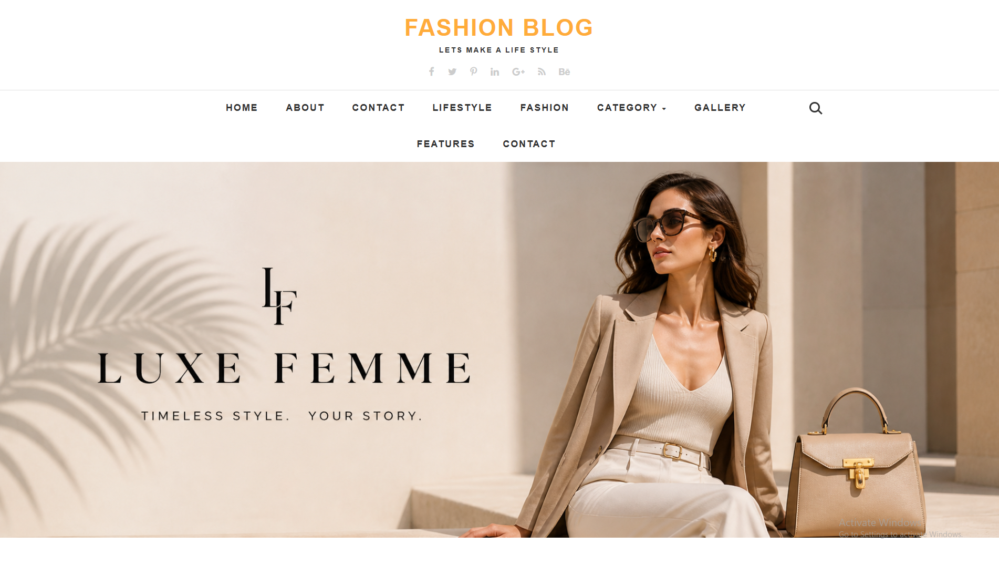
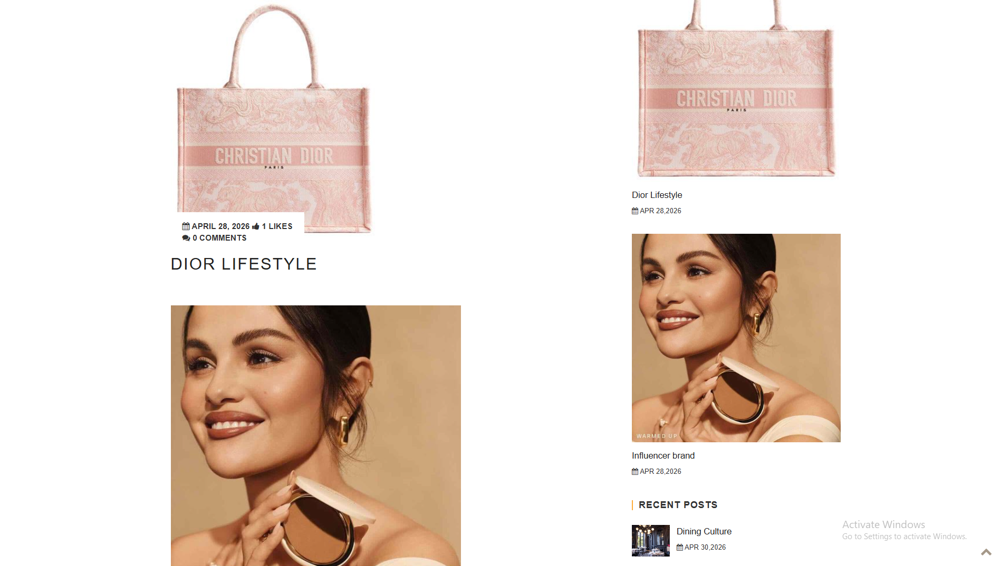
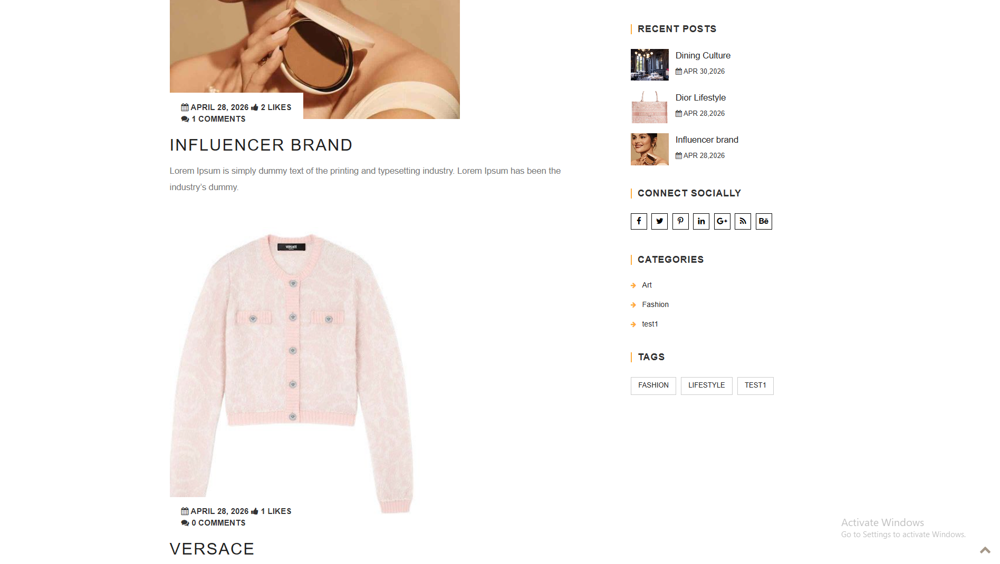
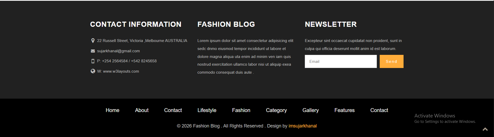

# Fashion Blog Custom WordPress Theme

Fashion Blog is a custom WordPress theme built for a fashion and lifestyle blog. It is based on the Underscores (`_s`) starter theme and extended with custom templates, widgets, layout controls, ACF option pages, and theme-specific styling.Built a custom About page template with static HTML/CSS sections for About, Skills, and Team content. Enabled other pages and posts to use Gutenberg editor content through standard WordPress page/post templates.

## Overview

This theme was developed as a custom WordPress blog theme with a focus on:

- Fashion and lifestyle blog layouts
- Dynamic homepage post listing
- Custom sidebar and footer widgets
- Inner page hero section
- Category archive pages
- Gutenberg-supported page and post content
- A hand-coded About page template
- Theme option pages and dashboard cleanup

## Features

- Custom homepage template with latest posts
- Category archive template with header, sidebar, content loop, and footer
- Single post template with comments and AJAX-based like functionality
- Custom About page template built with HTML and CSS
- Gutenberg-compatible page and post templates
- Custom widgets for:
  - Sidebar position
  - Inner page hero image
  - Breadcrumb
  - Search
  - Social links
  - Popular posts
  - Recent posts
  - Categories
  - Tags
  - Footer contact information
  - Footer about section
  - Newsletter block
- Custom footer widget columns
- Custom inner page hero section
- WordPress menu support for header and footer navigation
- ACF option pages for theme settings
- Cleaned dashboard menu for unused ACF pages
- Organized theme CSS sections
- WordPress jQuery no-conflict compatibility fix

## Demo Screenshots

### Homepage Hero



### Homepage Blog Layout



### Sidebar Widgets



### Footer Section



## Theme Structure

```text
merotheme/
├── assets/
│   ├── css/
│   ├── images/
│   └── js/
├── docs/
│   ├── images/
│   └── theme-workflow-and-widgets.md
├── inc/
│   ├── acf-options.php
│   ├── custom-header.php
│   ├── customizer.php
│   ├── enqueue.php
│   ├── template-functions.php
│   └── template-tags.php
├── template-parts/
├── 404.php
├── archive.php
├── category.php
├── comments.php
├── footer.php
├── front-page.php
├── functions.php
├── header.php
├── index.php
├── page-about.php
├── page.php
├── search.php
├── sidebar.php
├── single.php
└── style.css
```

## Important Templates

| File | Purpose |
|---|---|
| `front-page.php` | Homepage layout with latest posts |
| `page.php` | Default page template with Gutenberg content |
| `single.php` | Single blog post layout |
| `category.php` | Category archive layout |
| `archive.php` | General archive fallback |
| `page-about.php` | Custom About page built with HTML/CSS |
| `header.php` | Site header, logo, menu, search, hero widget area |
| `footer.php` | Footer widget columns and footer menu |
| `sidebar.php` | Main sidebar widget area |
| `comments.php` | Comments and reply form |
| `functions.php` | Theme setup, widget registration, hooks, AJAX handlers |

## Custom Widgets

The theme includes multiple custom widgets created with WordPress `WP_Widget` classes:

- `MeroTheme Sidebar Position`
- `MeroTheme Inner Page Hero`
- `MeroTheme Breadcrumb`
- `MeroTheme Search`
- `MeroTheme Social Links`
- `MeroTheme Popular Posts`
- `MeroTheme Recent Posts`
- `MeroTheme Categories`
- `MeroTheme Tags`
- `MeroTheme Footer Contact`
- `MeroTheme Footer About`
- `MeroTheme Newsletter`

These widgets can be managed from:

```text
Appearance > Widgets
```

## Sidebar Position

The sidebar position is controlled by the custom widget:

```text
Appearance > Widgets > MeroTheme Sidebar Position
```

Available options:

- Left sidebar
- Right sidebar

The selected value is used by the main templates to decide whether the sidebar should appear before or after the content.

## About Page

The About page uses a dedicated custom template:

```text
page-about.php
```

Unlike normal pages, this page is built using static HTML and CSS sections for:

- About content
- Skills
- Team members

Other pages and posts are designed to use Gutenberg editor content.

## ACF Usage

The theme includes ACF option page registration in:

```text
inc/acf-options.php
```

ACF is used for theme settings such as header, footer, social links, and back-to-top options.

Some unused ACF option pages are hidden from the dashboard menu to keep the admin panel cleaner.

## Post Likes

The theme includes an AJAX-based post like feature.

Main parts:

- Like button output in the single post template
- Like count stored in post meta as `post_likes`
- AJAX handler in `functions.php`
- JavaScript behavior in `assets/js/main.js`

The homepage displays the saved like count beside the thumbs-up icon.

## Installation

1. Copy the theme folder into:

```text
wp-content/themes/
```

2. Activate the theme from:

```text
Appearance > Themes
```

3. Add widgets from:

```text
Appearance > Widgets
```

4. Assign menus from:

```text
Appearance > Menus
```

5. Configure ACF option pages if ACF/ACF Pro is active.

## Recommended Plugins

- Advanced Custom Fields or ACF Pro
- Query Monitor for debugging during development

## Development Notes

- Root `style.css` contains the WordPress theme header and base Underscores styles.
- Main visual styling is in `assets/css/style.css`.
- Theme scripts are loaded from `inc/enqueue.php`.
- Widget classes and many theme hooks are currently defined in `functions.php`.
- Additional workflow documentation is available in:

```text
docs/theme-workflow-and-widgets.md
```

## Technologies Used

- WordPress
- PHP
- HTML5
- CSS3
- JavaScript
- jQuery
- Bootstrap
- Font Awesome
- Advanced Custom Fields

## Copyright And Credits

Copyright (c) 2026 Fashion Blog. imsujarkhanal

This theme is developed as a custom WordPress fashion blog theme project.

Credits:

- Based on the Underscores (`_s`) WordPress starter theme.
- Uses Bootstrap for layout support.
- Uses Font Awesome for icons.
- Uses Advanced Custom Fields for theme option pages.
- Demo content and screenshots are included for project presentation purposes.

Unless otherwise noted, custom PHP, CSS, JavaScript, templates, and theme modifications were developed for this project.

## Author

Sujar Khanal
